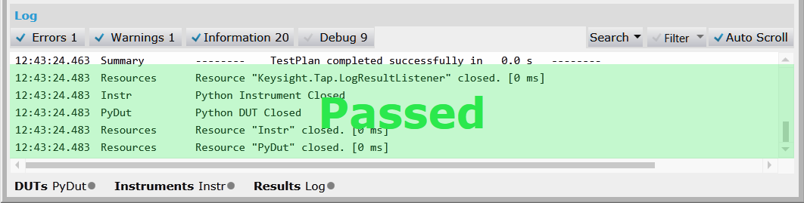

# Create and Run a Simple Test Plan for Windows
To just run the 'Basic Functionality' step, you can create a test plan with the following components in the GUI:

1. Add **Python Example / Basic Functionality** from the New Step dialog, located in the **Test Plan** panel.

2. In the DUT settings, add **Python Example / Basic DUT** (PyDUT).

3. In the Instrument settings, Add the **Python Example / Basic Instrument** (PyInstrument).

4. In the **Step Settings** panel, ensure that the DUT and instrument resources are assigned to the step.

5. In the **Test Plan** panel, click the **Run** button (F5).

The **Log** panel shows that the test passed:

Now we recommend exploring the rest of the Python Examples project. Try for example:
 - Running a battery charge / discharge scenario with the simulated power analyzer.
 - Connect steps using the Input/Output examples
 - Try modifying the Basic Functionality example to include your own log messages. You can also try this with code reloading enabled (In Python settings).