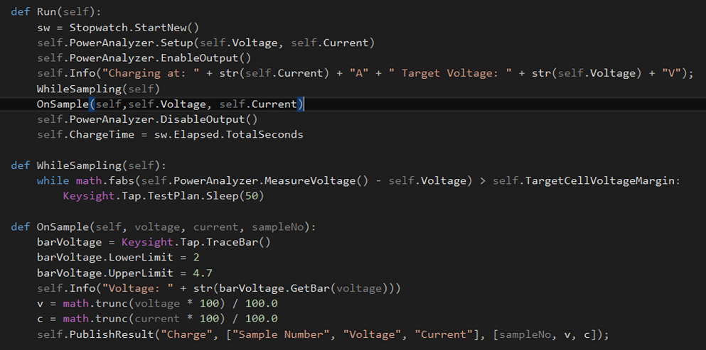

# Python Code Examples
The following code shows a basic test step implemented in both C# and Python.

**C# Implementation** 

```cs
using OpenTap;
namespace Example 
{
   [Display("Example Test Step", Group: "Examples", Description: "Test Step Description")]
   public class ExampleTestStep: TestStep
   {
      [Display("Step Setting")]
      public int StepSetting {get; set;}
	
      public ExampleTestStep()
      {
          StepSetting = 10;
      }
          
      public override void Run()
      {
          Log.Info("Running Test Step");
          UpgradeVerdict(Verdict.Pass);
      }
   }
}

```

**Python Implementation**

```py
from opentap import *
from System import Int32
import OpenTap

@attribute(OpenTap.Display("Example Test Step", "Test Step Description", "Examples"))
class ExampleTestStep(TestStep):
    StepSetting = property(Int32, 10).add_attribute(OpenTap.Display("Step Setting"))
    
    def __init__(self):
        super().__init__()
    
    def Run(self):
        self.log.Info("Running Test Step")
        self.UpgradeVerdict(OpenTap.Verdict.Pass)
```

So if you have developed a plugin in either language before you can see some clear similarities. 
The plugins are defined semantically equally, but in Python there is no concept of Properties and Attributes,
at least not in the same way as C#. So a bit of extra work is needed when implementing a property.
when ```self.AddProperty``` is called, it returns an object that represents meta-information for the property.
In addition, a python 'attribute' is created by the name defined by the string, for example "StepSetting".


## Test Step Example
The following example of a test step shows:

- How **@attribute** and **add_attribute** are used to control how data is presented to the user.
- Inheritance from base classes

 

## Test Plan Run Method
The code below shows how the run a method:

- Communicates with instruments defined with either C# or Python 
- Uses Python or .NET function libraries 
- Enables simple results publishing using self.PublishResult 
- Integrates with all OpenTAP Result Listeners 


