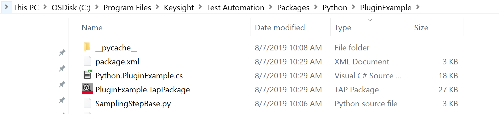
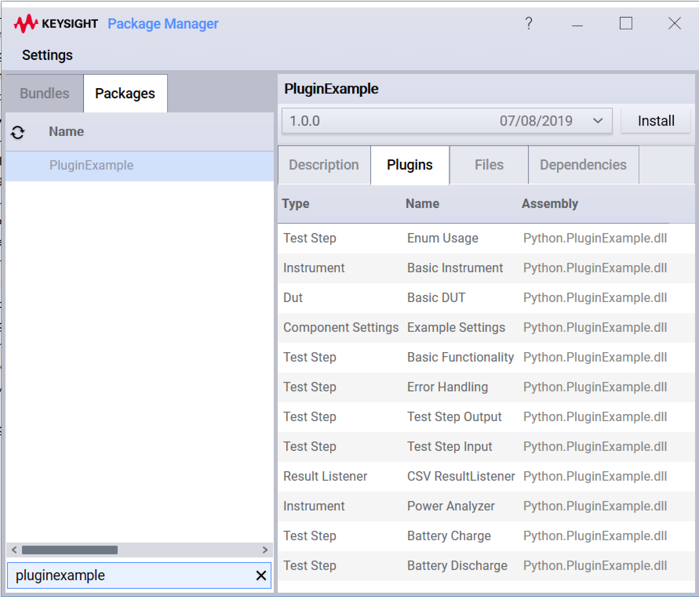

# Creating an OpenTAP Plugin with Python for Windows
Python development is done in modules (.py files) that reside in a Python package folder. Each module contains the code for one or more OpenTAP plugins. The Python package folder also contains an **`__init__.py`** file, which specifies which modules will be included in the plugin package.

In the following steps, *PluginExample* refers to your Python package folder. Follow these steps to create a Python plugin:

1. Create Python modules for your plugins. To start from scratch, develop your code in a folder within **%TAP_PATH%\\Packages\\Python**. To begin with the Python package build:

    a. Go to $TAP_PATH/Packages/Python and make a new folder with the desired plugin name. This has to be a valid Python module name.

    b. Add an `__init__.py` file where modules can be imported. Refer to the PluginExample __init__.py example to see how.

2. Build the plugin. From the Windows command prompt, go to %TAP_PATH% and execute:

      `tap python build PluginExample` 
      
      This process compiles the code in your .py files and creates a OpenTAP application extension named *Plugin.PluginExample.dll*.

3. Test your plugin in OpenTAP and modify your code as needed. Rebuild the plugin if you add new types or properties to the plugin types.

4. When the package is complete and ready for distribution, build a .TapPackage file. In %TAP_PATH%, execute:

    `tap python build PluginExample -build-package`
   
    This creates a plugin package named **PluginExample.TapPackage** in the %TAP_PATH%\\Packages\\Python\\PluginExample folder:

    

   This package contains all the python files from your module. It is important to ensure that the Python package folder is in the %TAP_PATH%\\Packages\\Python\\ folder. Note that dependencies (such as packages installed with pip.exe) are not automatically included in the Plugin file. The OpenTAP package system figures out your dependencies on other plugins and simplifies managing them.

Your plugin package is complete and ready for distribution. When viewed in OpenTAP Package Manager, users will be able to see and install your package.

