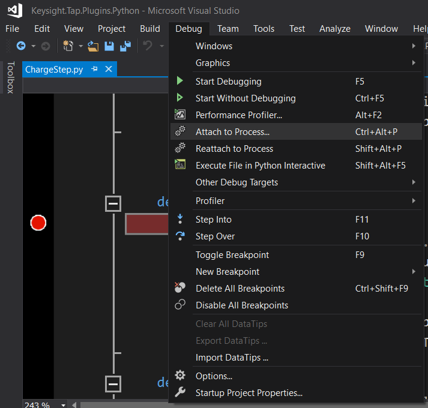
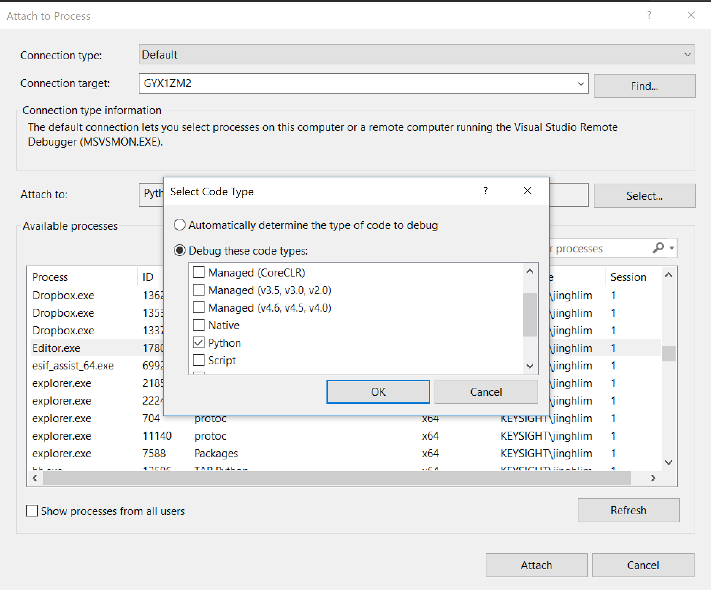
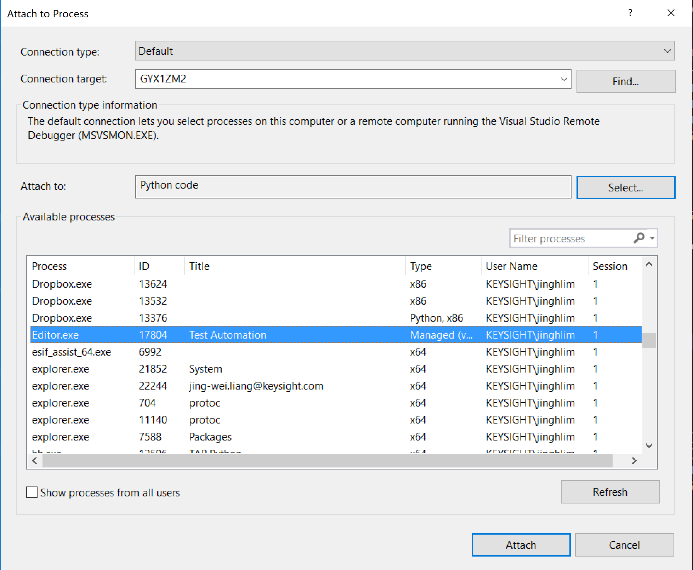

# Debugging Your Code

Two modes are support for debugging

- Remote Attaching to the running process in Visual Studio Code.
- Native Code debugging (Visual Studio / Windows only)

To follow this guide use an OpenTAP GUI likw PathWave Test Automation or OpenTAP TUI.

## Remote Attaching to the Running Process With VS Code

1. Enable debugging in Python Settings.
2. Start you OpenTAP GUI
3. From VS Code, open the folder containg your code. For example the OpenTAP installation folder.
4. Set a break point in your code
5. Click F5 and use 'Python: Remote Attach'

This should generate a launch.json file like so:
```json
{
    // Use IntelliSense to learn about possible attributes.
    // Hover to view descriptions of existing attributes.
    // For more information, visit: https://go.microsoft.com/fwlink/?linkid=830387
    "version": "0.2.0",
    "configurations": [
        {
            "name": "Python: Remote Attach",
            "type": "python",
            "request": "attach",
            "connect": {
                "host": "localhost",
                "port": 5678
            },
            "pathMappings": [
                {
                    "localRoot": "${workspaceFolder}",
                    "remoteRoot": "."
                }
            ],
            "justMyCode": true,
            
        } 
    ]
}

```

## Native Code Debugging
1. Launch your OpenTAP GUI.

2. Start up Microsoft Visual Studio, and select Debug, Attach to Process.



4. Click on Select, then select `Debug these code types:`, select Python and click OK.



5. Select Editor.exe from the available process list and click attach.



6. If there is no error message shown, and the stop button is enabled, you can now feel free to debug the Python script.


