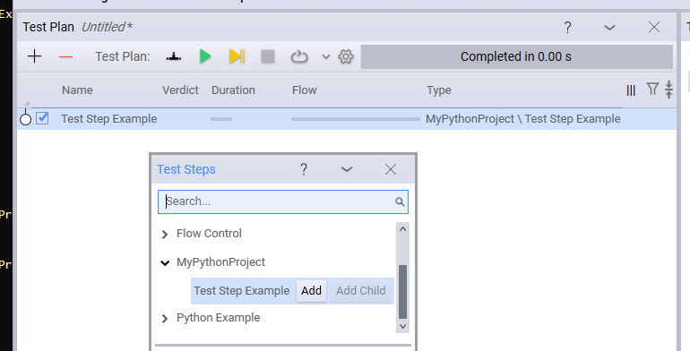

# New Project Creation

Creating a Python plugin from scratch could be done manually or with the help of the project creation wizard. The project tool helps you to start the development of a Python plugin project faster.

To create a new project, first find out where you want to place it and what to name it. Maybe you keep your python projects under your user folder or under C:\Projects. let's say C:\Projects and we want to name it MyPythonProject. In this case, do the following from your TAP installation folder:

1. `tap python new-project --directory C:\Projects\MyPythonProject --project-name MyPythonProject`

This should give you the following folder structure:

- MyPythonProject *This is your Python module named MyPythonProject.*
  - MyPythonProject/TestInstrument.py *This is an example of in instrument, it can be deleted.*
  - MyPythonProject/TestStepExample.py *This is also an example of a test step, it can be deleted.*
- MyPythonProject.Api *This is a C# project, which is useful to manage the OpenTap packages you want to have .*
  - MyPythonProject.Api/ExampleApi.cs  *This file contains an example of how to create and use C# interfaces with your Python code. .*
  - MyPythonProject.Api/MyPythonProject.Api.csproj  *This file contains the C# project definition, but also which packages gets installed when you build the project*
- bin *(After build) This folder contains a full OpenTAP installation, with all the dependencies you defined in the csproj file above.*
- MyPythonProject.sln * The C# solution file. Just ignore this.* 
- package.xml * This file contains definitions for your OpenTAP package. It can be used to create a .TapPackage file which can be distributed.*
- Readme.md * Contains some information on how to get started. It can be modified at your discretion. *


Once you have the folder structure set up, you can build the project using 
2. `dotnet build`.

This does not build your Python code, but it installs all the packages you need to a bin folder, which contains your debug build.

After completing this command you have a full OpenTAP installation just for hosting your plugin, but you'll probably also want to install other plugins. For example, you probably want a test plan editor installed to debug and run your code.

3. edit: MyPythonProject.Api/MyPythonProject.Api.csproj

Find these lines:
```xml
        <!-- Uncomment one of these lines to get a test plan editor installed when you build. -->
        <!-- <OpenTapPackageReference Include="Editor"/> -->
        <!-- <OpenTapPackageReference Include="EditorX"/> -->
        <!-- <OpenTapPackageReference Include="TUI"/> -->
```

Uncomment one or more of the lines containing OpenTapPackageReference to install something capable of editing a test plan.

4. `dotnet build` again.

After this build, you should have the editor installed. If you uncommented "Editor", you can now run bin\Editor.exe. To get an test plan editor running:


