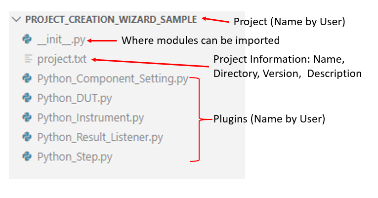

# Project Creation Wizard

Creating a Python plugin from scratch could be done manually or with the help of the project creation wizard. The project creation wizard helps you to start the development of a Python plugin project faster.

Command available:
1. `tap sdk new python-project`

The structure of a project created using the project creation wizard is shown in the following diagram.

After creating the Python plugin project, you may start the plugin development followed by building the Python plugins.

The project creation wizard is supported on both Windows and Ubuntu.

Otherwise, if you would like to create a project manually, please refer to:
1. [Creating an OpenTAP Plugin](./Creating_a_plugin.md)

## Generate Plugin Template in Existing Python Plugin Project

The project creation wizard allows you to generate and add the plugin templates into an existing Python plugin project.

The commands available for the types of OpenTAP plugin:
1. `tap sdk new python-dut`
2. `tap sdk new python-step`
3. `tap sdk new python-instrument`
4. `tap sdk new python-result-listener`
5. `tap sdk new python-component-setting`

Execute the command will generate a new plugin of the selected type to the output directory. The output directory must be a Python plugin project (a.k.a Python package folder containing `__init__.py` file).