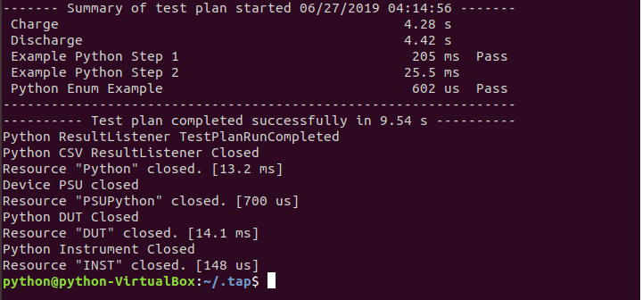

# Create and Run a Simple Test Plan for Ubuntu
To view a basic demonstration of the example, you can user the sample test plan and sample setting files as in setting up the components in the Window GUI:

1. Create Settings directory.
    
    `mkdir -p ~/.tap/Settings/Bench/Default`

2.  Copy setting files.
    
    `cp -r ~/.tap/Packages/Python/Linux\ Sample\ Files/Settings ~/.tap`

3. Run example test plan
    
    `~/.tap/tap run ~/.tap/Packages/Python/Linux\ Sample\ Files/Test\ Plans/Python27Example.TapPlan` (for Python2.7)

    `~/.tap/tap run ~/.tap/Packages/Python/Linux\ Sample\ Files/Test\ Plans/Python3xExample.TapPlan` (for Python3.6, Python3.7 and Python3.8)

The Summary of the result shows that the test plan completed successfully.

