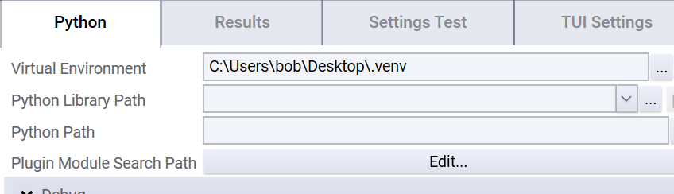

# Virtual Environments

A virtual environment is a folder which overlays the Python system installation with different packages and tools. 
This can be useful in order to isolate a specific environment and can be thought of as a Python-specific container.

Generally a virtual environment can created with the python command:

```py
python3 -m venv [virtual-environment-folder]
```

For example:
```python
python3 -m venv C:\Users\bob\Desktop\.venv
```

Now that the environment is created, it can be activated. On windows it looks like this, assuming a cmd.exe shell.
```bat 
[virtual-environment-folder]\Scripts\activate
```

On Linux or MacOS, there are similar but alternative ways to activate the environment.

When the environment is activated, a new PYTHONHOME environment variable is created. 
If you try to install packages using pip, then the packages will be installed into your virtual environment folder instead of the global folder. 
When you start a python interpreter, it will resolve those packages instead of those in your global installation.

### Using OpenTAP With a virtual environment
You can start an OpenTAP application, for example Editor.exe, from the cmd with the activated environment. That will have access to your virtual environment instead of the global environment. 

In **Python Plugin v3.2 or newer** You can also set the virtual environment in a GUI or through the command line as such:
```sh
#Python plugin v3.2+
tap python set-virtual-environment [virtual-environment-folder]
```

This will cause the virtual environment to be used always for that installation. You can unset it with

```shell
#Python plugin v3.2+
tap python set-virtual-environment --unset
```

In the UI, it is located under Python settings / Virtual Environments:




